# Practice of Vangogh Crazy World

Here are the source code for you practice on your local machine.
We also share some experience on how to fine tune the hyperparameter to gain a more suitable result of transfer target contents to as Vangogh's style. 
This is implemented by TensorFlow.

### Implement Details

Our implemetation is base on [fast-style-transfer](https://github.com/lengstrom/fast-style-transfer) and revise pooling function, maxpooling -> avgpooling. here is the pooling concept for your reference.

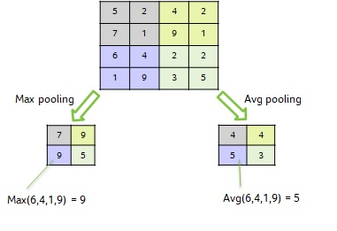

Because VGG19 network get the feature for style image by resizing image size to 256x256, we found revising style image closed to 256x256. Then we can get hyperparameter as more close to style when apply style to target contents. for example:

<table><tr><td>Content</td><td>Style</td><td>Result</td></tr>
<tr><td> 
 CC BY 2.0 by <a href https://ccsearch.creativecommons.org/photos/200fcf16-fd90-400b-9e7e-ead138e2f67d >Bryce Edwards</a></td><td>
 starry night with 300x255</td><td>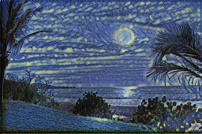</td></tr>
<tr><td> 
 CC BY 2.0 by <a href https://ccsearch.creativecommons.org/photos/200fcf16-fd90-400b-9e7e-ead138e2f67d >Bryce Edwards</a></td><td>
 starry night with 1280x1014</td><td>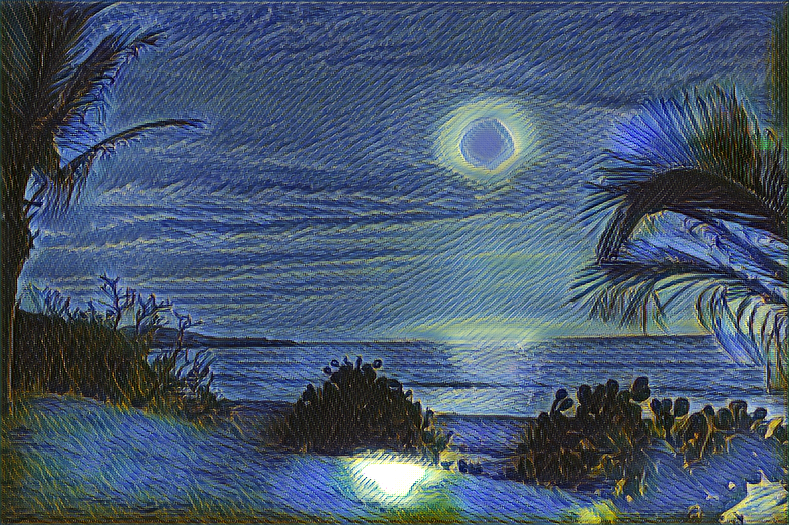</td></tr>
</table>
  

Following are some reuslt by different content weight & style weight for reference.

Base on starry night with 300x255:

<table><tr><td>Content weight</td><td>Style weight</td><td>Result</td></tr>
<tr><td>7e0</td><td>3e2</td><td>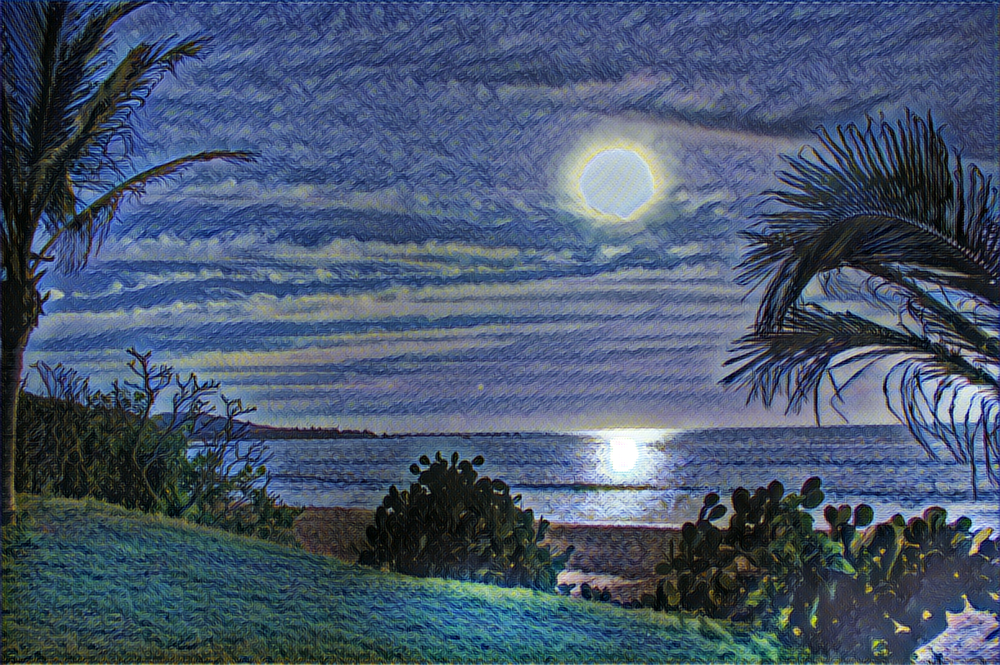</td></tr>
<tr><td>7e0</td><td>6e2</td><td>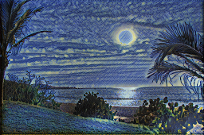</td></tr>
<tr><td>7e0</td><td>1e3</td><td></td></tr>
</table>

Following are some example that training target style by parameters, content weight: 7e0, style weight: 1e3, batch size: 1. 

<table><tr><td>content</td><td>Result</td><td>Vangogh Style</td></tr>
<tr><td>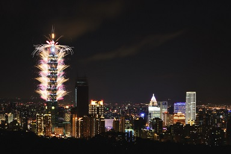   CC BY 2.0 by <a href='https://ccsearch.creativecommons.org/photos/4591be29-a60e-4499-99b1-0158ae5a2620'> Sinchen.Lin</a></td><td></td><td></td></tr>

<tr><td>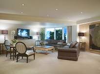  CC BY 2.0 by <a href='https://ccsearch.creativecommons.org/photos/c1e8a8f5-391a-4467-8740-bbcf7d1fb490'>ppacificvancouver</a></td><td>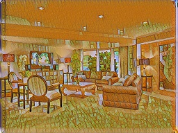</td><td></td></tr>

<tr><td> CC BY 2.0 by <a href='https://ccsearch.creativecommons.org/photos/f1dc2822-f4c1-4f66-8990-f9985a5dc179'> Andrew Gould</a></td><td></td><td></td></tr>

<tr><td> CC BY 2.0 by <a href='https://ccsearch.creativecommons.org/photos/a6a114be-a9b8-4997-a4f4-f166219eaf9f'> Sam Beebe</a></td><td></td><td></td></tr>

<tr><td>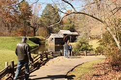 CC BY 2.0 by <a href='https://ccsearch.creativecommons.org/photos/e50874ce-3112-4560-b459-8556892d9d14'>Eli Christman </a></td><td></td><td>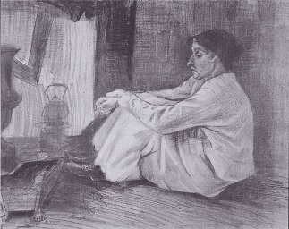</td></tr>

<tr><td>  CC BY 2.0 by <a href='https://ccsearch.creativecommons.org/photos/0c8907a8-8686-4def-8474-6ded08686879'>nan palmero</a></td><td></td><td>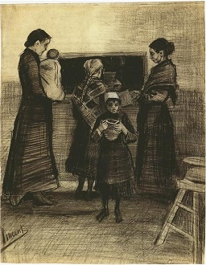</td></tr>

<tr><td> CC BY 2.0 by <a href='https://ccsearch.creativecommons.org/photos/75e55abf-5659-492b-babe-d9eb54b5779f'>Ms. Phoenix</a></td><td></td><td></td></tr>

<tr><td> CC BY 2.0 by <a href='https://ccsearch.creativecommons.org/photos/f1dc2822-f4c1-4f66-8990-f9985a5dc179'> Andrew Gould</a></td><td>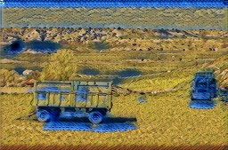</td><td></td></tr>

<tr><td> CC BY 2.0 by <a href='https://ccsearch.creativecommons.org/photos/f1dc2822-f4c1-4f66-8990-f9985a5dc179'> Andrew Gould</a></td><td></td><td>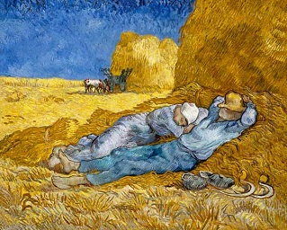</td></tr>

</table>

### Requirements
If you want to practice on Windows, following instructions in <a href='file:../windows'>Windows</a> practice to setup the practice environment.

If you want to practice on Chromebook, following instructions in <a href='file:../Chromebook'>Chromebook </a> practice to setup the practice environment.

### Training model

Use style.py to train a new style transfer network. Run python style.py to view all the possible parameters. Before training, you need get dataset from [COCO](http://images.cocodataset.org/zips/test2014.zip) and pre-trained model VGG19 from [matconvnet](http://www.vlfeat.org/matconvnet/), or execute **setup.sh** to get dataset and pre-train model. Example usage:

    python style.py --style path/to/style/img.jpg \
      --checkpoint-dir checkpoint/path \
      --test path/to/test/img.jpg \
      --test-dir path/to/test/dir \
      --content-weight 1.5e1 \
      --checkpoint-iterations 1000 \
      --batch-size 1

  
### Evaluating model  
Use evaluate.py to evaluate a style transfer network. Run python evaluate.py to view all the possible parameters. Example usage:

    python evaluate.py --checkpoint path/to/style/model.ckpt \
    --in-path dir/of/test/imgs/ \
    --out-path dir/for/results/

### Convert models
To use the trained model for developing application on different platform, we need convert them to other format.
The trained models is located to each folders for web, android, UWP usage.
models in the root of this project is for ml5.js needed
Chromebook/models is tensorflow lite for android app development
Windows/models is ONNX for UWP development

If you are going to train your own models, here is the instructions for you. enjoy it!!
#### Web
convert to ml5.js that is a high end api of tensorflow.js
<pre>
here is the instruction 
second instruction 
</pre>

#### Android
convert to tensorflow lite 
<pre>
instruction
</pre>
#### Win UWP
convert to ONNX
<pre>
instruction
</pre>
### Attributions/Thanks
Thanks all authors of following projects. 

* The source code of this practice is major borrowed from [fast-style-transfer](https://github.com/lengstrom/fast-style-transfer) Github repository.
* refer to some opinion in [Neural Style Transfer: A Review](https://arxiv.org/abs/1705.04058)
   

### License

This project is licensed under the MIT License, see the [LICENSE.md](LICENSE)

