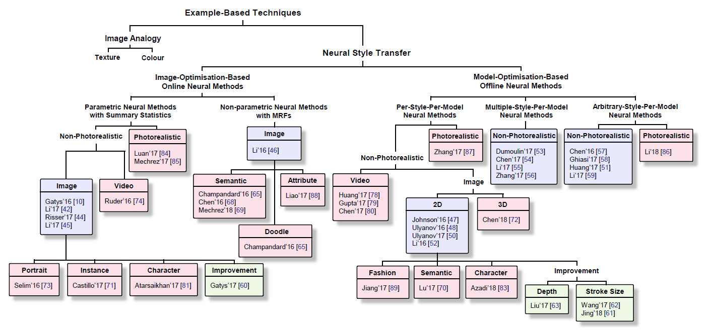
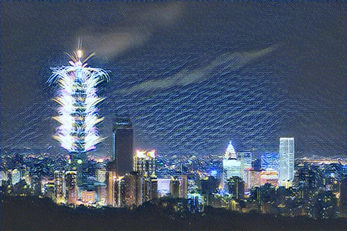
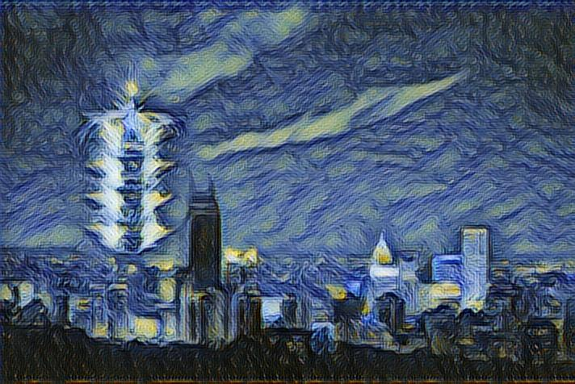
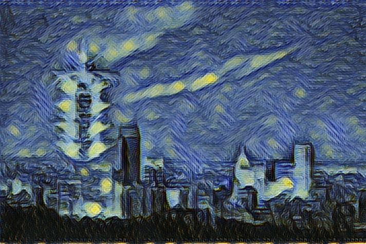
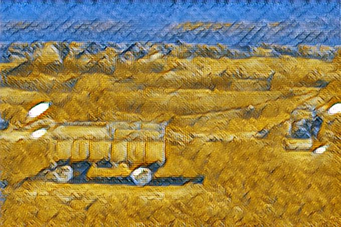

# Vangogh Crazy World

## Fast style transfer

Neural style transfer is the process of taking the style of one image then applying it to the content of another image. There is <a href="https://arxiv.org/abs/1705.04058">a review about Neural Style Transfer </a> that is worked out by Yongcheng Jing, Yezhou Yang, Zunlei Feng, Jingwen Ye, Yizhou Yu, Mingli Song



In this practice, we choose "Model-Optimisation-Based Offline Neural Methods", also called as "fast style transfer". It's Per-Style-Per-Model Neural Methods. 

Following describes the details about how we cook Vangogh Crazy World. Following this practice, you can learn how to build same scenario to Web, UWP(Windows), Android, and NCS that Intel announced for AIOT usage.

## About Vincent van Gogh

For more Vincent van Gogh, please refer to [wiki](https://en.wikipedia.org/wiki/Vincent_van_Gogh)

## Tensorflow

The source code in this project is written in [Tensorflow](https://www.tensorflow.org/)

You can find related instruction to train your own model file by this sample code.

Following also brief some tips about the experience while we were working on this project.


## Features

In this project, it will provide the following packages
* Training Van Gogh gallery with Python
* Inference with real time camera and still images and 
  * Deployment on <a href="https://github.com/acerwebai/VangoghCrazyWorld-UWP">Windows applications </a>
  * Deployment on <a href="https://github.com/acerwebai/VangoghCrazyWorld-Android">Android applications </a>
  * Deployment on <a href="https://github.com/acerwebai/VangoghCrazyWorld-Web">Web pages </a>
  * Deployment on <a href="https://github.com/acerwebai/VangoghCrazyWorld-NCS"> NCS </a> that Intel announced for AIOT usage.


## Getting Started


### Getting the Code

```
git clone https://github.com/acerwebai/VangoghCrazyWorld.git
```

### Get Pre-Trained Model

You can download the pre-trained models from here and should find the checkpoint files for each models

### Prerequisites

* Python 3.6

* (Optional) If your machine support [nVidia GPU with CUDA](https://developer.nvidia.com/cuda-gpus), please refer to the installation from nVidia 
	* CUDA v9.0: https://developer.nvidia.com/cuda-90-download-archive
	* cuDNN v7.3.0 for CUDA 9.0: https://developer.nvidia.com/rdp/cudnn-archive
	* Note: CUDA and cuDNN has [dependencies](https://docs.nvidia.com/deeplearning/sdk/cudnn-support-matrix/index.html)

* Tensorflow 1.12.0 
  * pip install tensorflow==1.12.0 for CPU
  * pip install tensorflow-gpu==1.12.0 for GPU

* Pillow 3.4.2, scipy 0.18.1, numpy 1.11.2, ffmpeg 3.1.3  or later version

### Create Virtual Environment

In creating a virtual environment you will create a directory containing a python binary and everything needed to run VangoghCrazyWorld.

Firstly, you need to install virtualenvwrapper via

```
pip install virtualenvwrapper
```

Then you can create a virtual environment using this command:

```
virtualenv -p python3 $HOME/tmp/VangoghCrazyWorld-venv/
```

And activate the virtual environment like this 

```
source $HOME/tmp/VangoghCrazyWorld-venv/Scripts/activate
```

In that, you can isolate the working environments project by project.

So, please work on this virtual environment for the following installations.

### Installing

Change directory to VangoghCrazyWorld, where the git clone goes

```
cd VangoghCrazyWorld
```

We have already make all required packages listing in the requirements.txt, all you need to do is just to pip install the dependencies

```
pip install -r requirements.txt
```

Note: If your machine do not support nVidia GPU, please replace Tensorflow-gpu as Tensorflow inside the requirements.txt

### Get Dataset & VGG19

Before training, you need get dataset from [COCO](http://images.cocodataset.org/zips/test2014.zip) and VGG19 from [matconvnet](http://www.vlfeat.org/matconvnet/), or execute **setup.sh** to get dataset and VGG19

```
./setup.sh
 
```

### Run Pre-Trained Models

Now, you have all the packages for running the pre-trained models
You can have a trial run the starrynight style model that we have pre-trained, from the as following 

for example: you want to evaluate images in examples/content with starrynight-300-255-NHWC_nbc8_bs1_7e00_1e03_0.01the instruction is as here.
```
python evaluate.py --data-format NHWC --num-base-channels 4 --checkpoint tf-models/starrynight-300-255-NHWC_nbc4_bs1_7e00_1e03_0.01 \
  --in-path examples/content  \
  --out-path examples/results  \
  --allow-different-dimensions
 
```

where
* --data-format: NHWC is for tensorflow sieries framework, NCHW is for non-tensorflow series, ex. ONNX that WinML required.
* --num-base-channels: it's used to reduce model size to improve inference time on Web, and other lower compute platform.
* --checkpoint: is the path where you place the pre-trained model checkpoint
* --in-path: is the path to input images, can be a folder or a file
* --out-path: is the path to output images, can be a folder or a file

## Training

Let's start to do the training

```
python style.py --data-format NHWC --num-base-channels 4 --style examples/style/starrynight-300-255.jpg \
  --checkpoint-dir ckpts \
  --test examples/content/farm.jpg \
  --test-dir examples/result \
  --content-weight 7e0 \
  --style-weight 1e3
  --checkpoint-iterations 1000 \
  --learning-rate 1e-3
  --batch-size 1
```

where

you need create a folder "ckpts" in the root of this project to save chackpoint files.
* --data-format: NHWC is for tensorflow sieries framework, NCHW is for non-tensorflow series, ex. ONNX that WinML required.
* --num-base-channels: it's used to reduce model size to improve inference time on Web, and other lower compute platform.
* --checkpoint-dir: is the path to save checkpoint in
* --style: style image path
* --train-path: path to training images folder
* --test: test image path
* --test-dir: test image save dir
* --epochs: number of epochs
* --batch-size: number of images feed for a batch
* --checkpoint-iterations: checkpoint save frequency
* --vgg-path: path to VGG19 network
* --content-weight: content weight
* --style-weight: style weight
* --tv-weight: total variation regularization weight
* --learning-rate: learning rate


## Evaluating

You can evaluate the trained models via

```
python evaluate.py --data-format NHWC --num-base-channels 4 --checkpoint tf-models/starrynight-300-255-NHWC_nbc4_bs1_7e00_1e03_0.01 \
  --in-path examples/content/farm.jpg \
  --out-path examples/results/
```


## Tuning Parameters

In this practice, we offer 3 style similar level to let you experience the different style level. the are tuned by content-weight, style-weight, and learning-rate  

* --content-weight
* --style-weight
* --learning-rate


### Freeze Model

If you need get freeze model file, following the instruction that tensorflow bundled here
```
python -m tensorflow.python.tools.freeze_graph --input_graph=tf-model/starrynight-300-255-NHWC_nbc8_bs1_7e00_1e03_0.001/graph.pbtxt \
--input_checkpoint=tf-model/starrynight-300-255-NHWC_nbc8_bs1_7e00_1e03_0.001/saver \
--output_graph=tf-models/starrynight.pb --output_node_names="output"
```


## Implementation Details
The implementation is based on the [Fast Style Transfer in TensorFlow from ](https://github.com/lengstrom/fast-style-transfer) from [lengstrom](https://github.com/lengstrom/fast-style-transfer/commits?author=lengstrom)

Here are the source code for you practice on your local machine.
We also share some experience on how to fine tune the hyperparameter to gain a more suitable result of transfer target contents to as Vangogh's style.<br>


Our implemetation is base on [fast-style-transfer](https://github.com/lengstrom/fast-style-transfer) and revise pooling function, maxpooling -> avgpooling. here is the pooling concept for your reference.
<p align = 'center'>

</p>

Because VGG19 network get the feature for style image by resizing image size to 256x256, we found revising style image closed to 256x256. Then we can get hyperparameter as more close to style when apply style to target contents. for example:

<table><tr><td>Content</td><td>Style</td><td>Result</td></tr>
<tr><td> <p> CC BY 2.0 by <a href https://ccsearch.creativecommons.org/photos/200fcf16-fd90-400b-9e7e-ead138e2f67d >Bryce Edwards</a></td><td><p> starry night with 300x255</td><td></td></tr>
<tr><td> <p> CC BY 2.0 by <a href https://ccsearch.creativecommons.org/photos/200fcf16-fd90-400b-9e7e-ead138e2f67d >Bryce Edwards</a></td><td><p> starry night with 1280x1014</td><td></td></tr>
</table>
  

Following are some reuslt by different content weight & style weight for reference.<p>
Base on starry night with 300x255:

<table><tr><td>Content weight</td><td>Style weight</td><td>learning rate</td><td>Result</td></tr>
<tr><td>7e1</td><td>6e2</td><td>1e-2</td><td></td></tr>
<tr><td>7e0</td><td>6e2</td><td>1e-2</td><td></td></tr>
<tr><td>7e0</td><td>1e3</td><td>1e-2</td><td></td></tr>
</table>

Following are some example that training target style by parameters, content weight(cw), style weight(sw), learning rate(lr), and batch size: 1. 

<table><tr><td>content</td><td>Result</td><td>Vangogh Style</td></tr>
<tr><td> <br> CC BY 2.0 by <a href='https://ccsearch.creativecommons.org/photos/4591be29-a60e-4499-99b1-0158ae5a2620'> Sinchen.Lin</a></td><td><br>cw:7e0, sw:1e3, lr:1e-2</td><td><br>The starry night</td></tr>

<tr><td><br> CC BY 2.0 by <a href='https://ccsearch.creativecommons.org/photos/c1e8a8f5-391a-4467-8740-bbcf7d1fb490'>ppacificvancouver</a></td><td><br>cw:7e0, sw:1e3, lr:1e-3</td><td><br>Vincent's bedroom in Aries</td></tr>

<tr><td><br>CC BY 2.0 by <a href='https://ccsearch.creativecommons.org/photos/f1dc2822-f4c1-4f66-8990-f9985a5dc179'> Andrew Gould</a></td><td><br>cw:7e0, sw:1e3, lr:1e-3</td><td><br>The Red Vineyard</td></tr>

<tr><td><br>CC BY 2.0 by <a href='https://ccsearch.creativecommons.org/photos/a6a114be-a9b8-4997-a4f4-f166219eaf9f'> Sam Beebe</a></td><td><br>cw:7e0, sw:1e3, lr:1e-3</td><td><br>Self-Portrait</td></tr>

<tr><td><br>CC BY 2.0 by <a href='https://ccsearch.creativecommons.org/photos/e50874ce-3112-4560-b459-8556892d9d14'>Eli Christman </a></td><td><br>cw:7e0, sw:1e3, lr:1e-3</td><td><br>Sien with a cigar</td></tr>

<tr><td><br> CC BY 2.0 by <a href='https://ccsearch.creativecommons.org/photos/0c8907a8-8686-4def-8474-6ded08686879'>nan palmero</a></td><td><br>cw:7e0, sw:1e3, lr:1e-3</td><td><br>Soup Distribution in a Public Soup Kitchen</td></tr>

<tr><td><br>CC BY 2.0 by <a href='https://ccsearch.creativecommons.org/photos/75e55abf-5659-492b-babe-d9eb54b5779f'>Ms. Phoenix</a></td><td><br>cw:7e0, sw:1e3, lr:1e-3</td><td><br> Sunflowers(1889)</td></tr>

<tr><td><br>CC BY 2.0 by <a href='https://ccsearch.creativecommons.org/photos/f1dc2822-f4c1-4f66-8990-f9985a5dc179'> Andrew Gould</a></td><td><br>cw:7e0, sw:6e2, lr:1e-3</td><td><br>Wheatfield with Crows</td></tr>

<tr><td><br>CC BY 2.0 by <a href='https://ccsearch.creativecommons.org/photos/f1dc2822-f4c1-4f66-8990-f9985a5dc179'> Andrew Gould</a></td><td><br>cw:7e0, sw:6e2, lr:1e-4</td><td><br>Rest from Work </td></tr>

</table>


## License

This project is licensed under the MIT, see the [LICENSE.md](LICENSE)

## Acknowledgments

Thanks all authors of following projects. 

* The source code of this practice is major borrowed from [fast-style-transfer](https://github.com/lengstrom/fast-style-transfer) Github repository.
* refer to some opinion in [Neural Style Transfer: A Review](https://arxiv.org/abs/1705.04058)


