# Vangogh Crazy World

## Neural style transfer

Neural style transfer is the process of taking the style of one image then applying it to the content of another image.

Offering you a variety of beautiful styles some of which are paintings by famous artists like Starry Night by Van Gogh.


## Vincent van Gogh

For more Vincent van Gogh, please refer to [wiki](https://en.wikipedia.org/wiki/Vincent_van_Gogh)

## Tensorflow

The source code in this project is written in Tensorflow

For more Vincent van Gogh, please refer to [Tensorflow](https://www.tensorflow.org/)


## Experience

We would like to bring you to Vangogh Crazy World, insight the sample code, you can use pre-trained model or you can try to train your own models.

After that you can decided to deploy on various devices which running on to Windows or Android and even OS independent web pages.

**Table of Contents**
  * [Features](#features)
  * [Getting Started](#getting-started)
    + [Getting the Code](#getting-the-code)
    + [Get Pre-Trained Model](#get-pre-trained-model)
    + [Prerequisites](#prerequisites)
    + [Create Virtual Environment](#create-virtual-environment)
    + [Installing](#installing)
    + [Get Pre-Trained Models](#get-pre-trained-models)
    + [Run Pre-Trained Models](#run-pre-trained-models)
  * [Training](#training)
  * [Evaluating](#evaluating)
  * [Tuning Parameters](#tuning-parameters)
  * [Transfer Taining, build your own model](#transfer-taining--build-your-own-model)
    + [Find Your Checkpoint](#find-your-checkpoint)
    + [Freeze Model](#freeze-model)
  * [Before Deployment](#before-deployment)
    + [Convert Models](#convert-models)
    + [TFLITE for Android APP](#tflite-for-android-app)
    + [ONNX for UWP APP](#onnx-for-uwp-app)
    + [Tensorflow.js for Web Page](#tensorflowjs-for-web-page)
  * [Deployment](#deployment)
    + [Android APP](#android-app)
    + [UWP APP](#uwp-app)
    + [Web Pages](#web-pages)
  * [Implementation Details](#implementation-details)
    + [Paper](#paper)
    + [Framework](#framework)
    + [Model](#model)
    + [Optimization](#optimization)
  * [Contributing](#contributing)
  * [Versioning](#versioning)
  * [Team](#team)
  * [FAQ](#faq)
  * [Support](#support)
  * [License](#license)
  * [Acknowledgments](#acknowledgments)


## Features

In this project, it will provide the following packages
* Training Van Gogh gallery with Python
* Inference with real time camera and still images and 
  * Deployment on Windows applications
  * Deployment on Android applications
  * Deployment on web pages


## Getting Started


### Getting the Code

```
git clone https://github.com/acerwebai/VangoghCrazyWorld.git
```

### Get Pre-Trained Model

You can download the pre-trained models from here and should find the checkpoint files for each models

### Prerequisites

* Python 3.6

* (Optional) If your machine support [nVidia GPU with CUDA](https://developer.nvidia.com/cuda-gpus), please refer to the installation from nVidia 
	* CUDA: https://docs.nvidia.com/cuda/
	* cuDNN: https://docs.nvidia.com/deeplearning/sdk/cudnn-install/index.html
	* Note: CUDA and cuDNN has [dependencies](https://docs.nvidia.com/deeplearning/sdk/cudnn-support-matrix/index.html)

### Create Virtual Environment

In creating a virtual environment you will create a directory containing a python binary and everything needed to run VangoghCrazyWorld.

Firstly, you need to install virtualenvwrapper via

```
pip install virtualenvwrapper
```

Then you can create a virtual environment using this command:

```
virtualenv -p python3 $HOME/tmp/VangoghCrazyWorld-venv/
```

And activate the virtual environment like this 

```
source $HOME/tmp/VangoghCrazyWorld-venv/bin/activate
```

In that, you can isolate the working environments project by project.

So, please workon this virtual environment for the following installations.

### Installing

Change directory to VangoghCrazyWorld, where the git clone goes

```
cd VangoghCrazyWorld
```

We have already make all required packages listing in the requirements.txt, all you need to do is just to pip install the dependencies

```
pip install -r requirements.txt
```

Note: If your machine do not support nVidia GPU, please replace Tensorflow-gpu as Tensorflow inside the requirements.txt

### Get Pre-Trained Models

Before training, you need get dataset from [COCO](http://images.cocodataset.org/zips/test2014.zip) and pre-trained model VGG19 from [matconvnet](http://www.vlfeat.org/matconvnet/), or execute **setup.sh** to get dataset and pre-train model

```
./setup.sh
 
```

### Run Pre-Trained Models

Now, you have all the packages for running the pre-trained models
You can have a trial run the starrynight style model that we have pre-trained, from the as following 

```
python evaluate.py --checkpoint path/to/style/starrynight \
  --in-path dir/of/test/imgs/ \
  --out-path dir/for/results/
 
```

where
* --checkpoint: is the path where you place the pre-trained model checkpoint
* --in-path: is the path to input images, can be a folder or a file
* --out-path: is the path to output images, can be a folder or a file

## Training

Let's start to do the training

```
python style.py --style path/to/style/starrynight.jpg \
  --checkpoint-dir checkpoint/path \
  --test path/to/test/img.jpg \
  --test-dir path/to/test/dir \
  --content-weight 1.5e1 \
  --checkpoint-iterations 1000 \
  --batch-size 8
```

where
* --checkpoint-dir: is the path to save checkpoint in
* --style: style image path
* --train-path: path to training images folder
* --test: test image path
* --test-dir: test image save dir
* --epochs: number of epochs
* --batch-size: number of images feed for a batch
* --checkpoint-iterations: checkpoint save frequency
* --vgg-path: path to VGG19 network
* --content-weight: content weight
* --style-weight: style weight
* --tv-weight: total variation regularization weight
* --learning-rate: learning rate


## Evaluating

You can evaluate the trained models via

```
python evaluate.py --checkpoint path/to/style/starrynight \
  --in-path dir/of/test/imgs/ \
  --out-path dir/for/results/
```


## Tuning Parameters

The Loss function of the style transfer can be illustrated as

``` 
Loss = alpha*C_loss(C_Lys, C, G) + beta*S_Loss(S_Lys, S, G)
```

Therefore, we can tuning the total loss via  

* --content-weight
* --style-weight

Please see [Implementation Details] (#Implementation Details) for the techniques we have found.
You can refer to [this medium post](https://towardsdatascience.com/practical-techniques-for-getting-style-transfer-to-work-19884a0d69eb) as well to see other techniques


## Transfer Taining, build your own model

You can change the style image whatever you would like to train
You can change any parameters and see how it changed and make it reach to your design

```
python style.py --style path/to/style/img.jpg \
  --checkpoint-dir checkpoint/path \
  --test path/to/test/img.jpg \
  --test-dir path/to/test/dir \
  --style-weight 7.5e2 \
  --content-weight 1.5e1 \
  --checkpoint-iterations 1000 \
  --batch-size 8
```
### Find Your Checkpoint

You should find the checkpoint @--checkpoint-dir folder

### Freeze Model

You should find the checkpoint @--checkpoint-dir folder
We need frozen model for deployment to various devices in Windows or Android, or even OS independent web pages.
You can use the Tensorflow [freeze_graph.py](https://github.com/tensorflow/tensorflow/blob/master/tensorflow/python/tools/freeze_graph.py) to make it frozen

```
freeze_graph \
--input_graph=/home/acer/fast-style-transfer/ckpt/your_chpt/fns.ckpt/save_graph.pb \
--input_checkpoint=/home/acer/fast-style-transfer/ckpt/your_chpt/fns.ckpt \
--output_graph=/home/acer/fast-style-transfer/ckpt/doesburg_20181229/fns.ckpt/frozen.pb \
--input_binary=True \
--output_node_names=add_37 

```
This will be the batch and shape while your training

We made a utility to load the ckpt and make it a frozen model pb with the batch size is 1 shape you wourld like to have for inference

```
python evaluate_plus_save_all_pb.py --checkpoint /home/acer/fast-style-transfer/ckpt/640_480 \
  --in-path 640_480.jpg \
  --out-path 640_480_converted.jpg
  
```
You will find 3 files for your inference purpose

```
save_graph.pb
save_graph.pbtxt
frozen.pb
```

## Before Deployment

Before deployment, coverting models for inferencing in various applications is needed

### Convert Models

There have several reasons that we need to conver the model from frozen pb
* Application: different application need different model file, for example, UMP via WinML only support ONNX model, web application need to be converted to be tensorflow.js
* Optimization: If we want to deploy the model to less computing devices, for example: Android applications running on Chromebook or Android phone 

### TFLITE for Android APP

We use tensorflow lite converter to convert the frozen pb

```

tflite_convert \
  --graph_def_file=/home/acer/fast-style-transfer/ckpt/doesburg_20190116/frozen.pb \
  --output_file=/home/acer/fast-style-transfer/ckpt/doesburg_20190116/shape_1_256_256_3.tflite \
  --input_format=TENSORFLOW_GRAPHDEF \
  --output_format=TFLITE \
  --input_shape=1,256,256,3 \
  --input_array=X_content \
  --output_array=add_37 \
  --inference_type=FLOAT \
  --input_data_type=FLOAT

```

Note: tflite_convert support squredifference operator after Tensorflow 1.13.0.dev20190117, you need to use Tensorflow version greater than 1.13.0.dev20190117 to avoid the converting error

After that, you can use tflite model for inference on Android application

### ONNX for UWP APP

You need to convert the model via onnx2

```

python -m tf2onnx.convert\
    --input /home/acer/fast-style-transfer/ckpt/doesburg_20190115_test/frozen.pb\
    --inputs X_content:0\
    --outputs add_37:0\
    --output /home/acer/fast-style-transfer/ckpt/doesburg_20190115_test/model.onnx\
    --verbose \
    --fold_const\
    --inputs-as-nchw X_content:0,add_37:0
    
```

### Tensorflow.js for Web Page


## Deployment

For the deployment, please follow the instructions below and buit with

### Android APP
See [Android Application](https://github.com/acerwebai/VangoghCrazyWorld/blob/master/Chromebook/README.md)
### UWP APP
See [Windows_README.md](Windows_README.md)
### Web Pages
See [Web_README.md](Web.md)

## Implementation Details
The implementation is based on the [Fast Style Transfer in TensorFlow from ](https://github.com/lengstrom/fast-style-transfer) from [lengstrom](https://github.com/lengstrom/fast-style-transfer/commits?author=lengstrom)

It use roughly the same transformation network as described in Johnson, except that batch normalization is replaced with Ulyanov's instance normalization, and the scaling/offset of the output tanh layer is slightly different. We use a loss function close to the one described in Gatys, using VGG19 instead of VGG16 and typically using "shallower" layers than in Johnson's implementation (e.g. we use relu1_1 rather than relu1_2). Empirically, this results in larger scale style features in transformations.

Here are the source code for you practice on your local machine.
We also share some experience on how to fine tune the hyperparameter to gain a more suitable result of transfer target contents to as Vangogh's style.<br>
This is implemented by TensorFlow.


Our implemetation is base on [fast-style-transfer](https://github.com/lengstrom/fast-style-transfer) and revise pooling function, maxpooling -> avgpooling. here is the pooling concept for your reference.
<p align = 'center'>

</p>

Because VGG19 network get the feature for style image by resizing image size to 256x256, we found revising style image closed to 256x256. Then we can get hyperparameter as more close to style when apply style to target contents. for example:

<table><tr><td>Content</td><td>Style</td><td>Result</td></tr>
<tr><td> <p> CC BY 2.0 by <a href https://ccsearch.creativecommons.org/photos/200fcf16-fd90-400b-9e7e-ead138e2f67d >Bryce Edwards</a></td><td>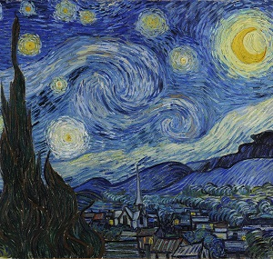<p> starry night with 300x255</td><td></td></tr>
<tr><td> <p> CC BY 2.0 by <a href https://ccsearch.creativecommons.org/photos/200fcf16-fd90-400b-9e7e-ead138e2f67d >Bryce Edwards</a></td><td><p> starry night with 1280x1014</td><td>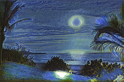</td></tr>
</table>
  

Following are some reuslt by different content weight & style weight for reference.<p>
Base on starry night with 300x255:

<table><tr><td>Content weight</td><td>Style weight</td><td>Result</td></tr>
<tr><td>7e0</td><td>3e2</td><td></td></tr>
<tr><td>7e0</td><td>6e2</td><td></td></tr>
<tr><td>7e0</td><td>1e3</td><td></td></tr>
</table>

Following are some example that training target style by parameters, content weight: 7e0, style weight: 1e3, batch size: 1. 

<table><tr><td>content</td><td>Result</td><td>Vangogh Style</td></tr>
<tr><td> <br> CC BY 2.0 by <a href='https://ccsearch.creativecommons.org/photos/4591be29-a60e-4499-99b1-0158ae5a2620'> Sinchen.Lin</a></td><td>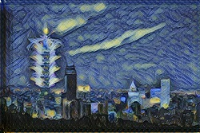</td><td></td></tr>

<tr><td><br> CC BY 2.0 by <a href='https://ccsearch.creativecommons.org/photos/c1e8a8f5-391a-4467-8740-bbcf7d1fb490'>ppacificvancouver</a></td><td>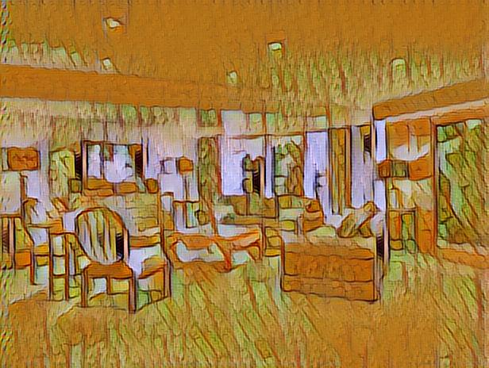</td><td>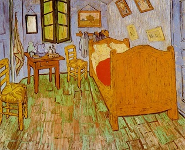</td></tr>

<tr><td>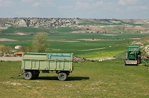<br>CC BY 2.0 by <a href='https://ccsearch.creativecommons.org/photos/f1dc2822-f4c1-4f66-8990-f9985a5dc179'> Andrew Gould</a></td><td>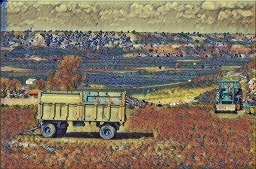</td><td>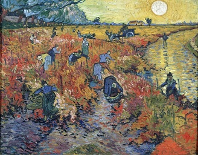</td></tr>

<tr><td>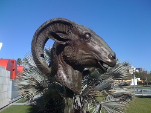<br>CC BY 2.0 by <a href='https://ccsearch.creativecommons.org/photos/a6a114be-a9b8-4997-a4f4-f166219eaf9f'> Sam Beebe</a></td><td>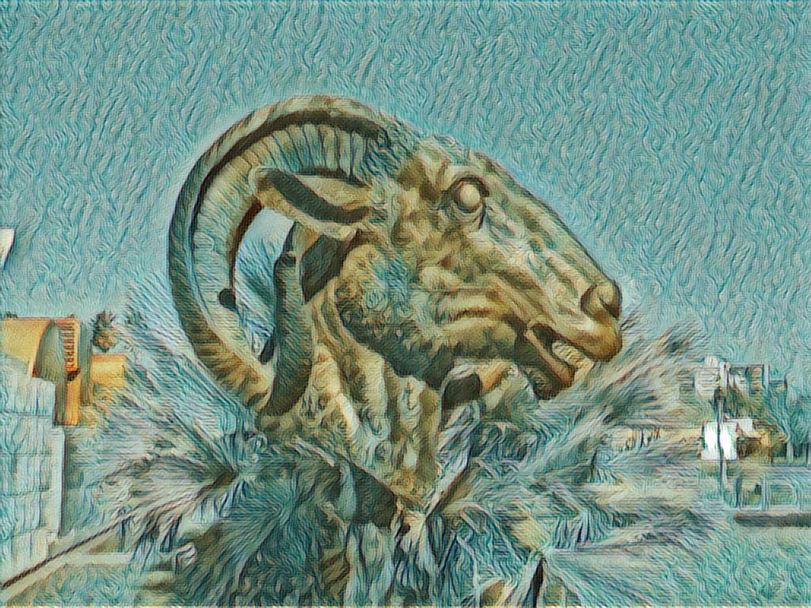</td><td>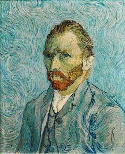</td></tr>

<tr><td><br>CC BY 2.0 by <a href='https://ccsearch.creativecommons.org/photos/e50874ce-3112-4560-b459-8556892d9d14'>Eli Christman </a></td><td>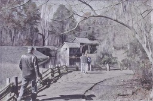</td><td></td></tr>

<tr><td>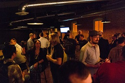<br> CC BY 2.0 by <a href='https://ccsearch.creativecommons.org/photos/0c8907a8-8686-4def-8474-6ded08686879'>nan palmero</a></td><td>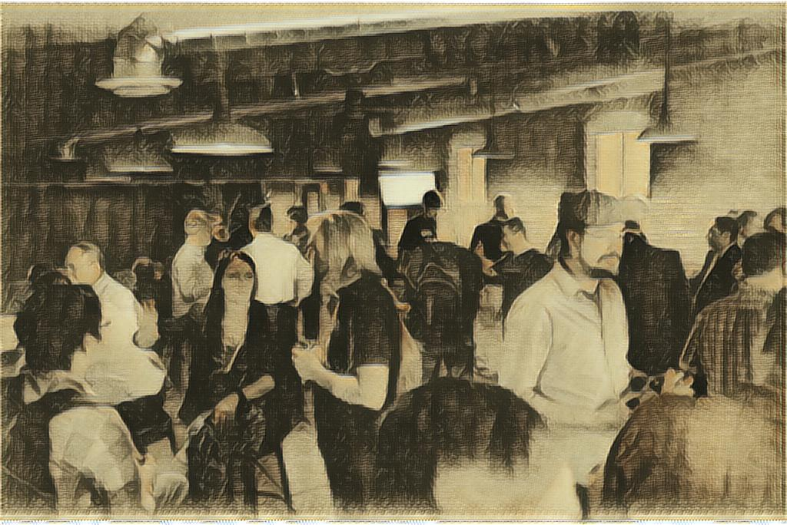</td><td></td></tr>

<tr><td><br>CC BY 2.0 by <a href='https://ccsearch.creativecommons.org/photos/75e55abf-5659-492b-babe-d9eb54b5779f'>Ms. Phoenix</a></td><td>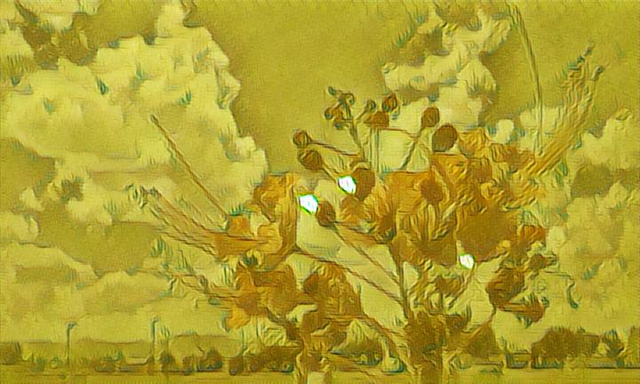</td><td>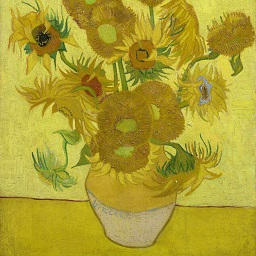</td></tr>

<tr><td><br>CC BY 2.0 by <a href='https://ccsearch.creativecommons.org/photos/f1dc2822-f4c1-4f66-8990-f9985a5dc179'> Andrew Gould</a></td><td>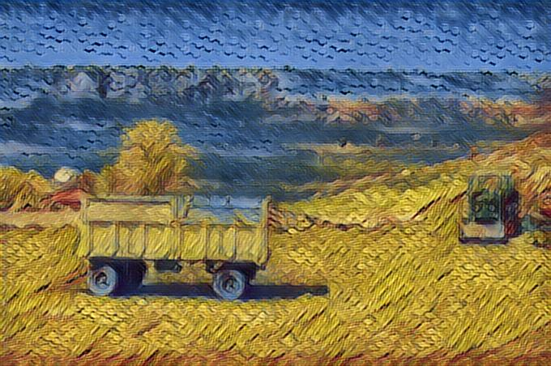</td><td>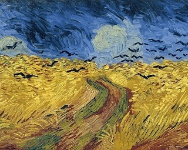</td></tr>

<tr><td><br>CC BY 2.0 by <a href='https://ccsearch.creativecommons.org/photos/f1dc2822-f4c1-4f66-8990-f9985a5dc179'> Andrew Gould</a></td><td>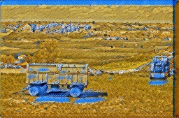</td><td></td></tr>

</table>


### Paper

[Perceptual Losses for Real-Time Style Transfer and Super-Resolution](https://cs.stanford.edu/people/jcjohns/eccv16/)


### Framework

[Tensorflow](https://www.tensorflow.org/)

### Model

VGG19

### Optimization


## Contributing

Please read [CONTRIBUTING.md](https://gist.github.com/PurpleBooth/b24679402957c63ec426) for details on our code of conduct, and the process for submitting pull requests to us.

See also the list of [contributors](https://github.com/your/project/contributors) who participated in this project.


## Versioning

Version and release note

## Team

Team member

## FAQ

Frequently ask questions

## Support

Who you should contact with, email


## License

This project is licensed under the Apache License 2.0, see the [LICENSE.md](LICENSE)

## Acknowledgments

Thanks all authors of following projects. 

* The source code of this practice is major borrowed from [fast-style-transfer](https://github.com/lengstrom/fast-style-transfer) Github repository.
* refer to some opinion in [Neural Style Transfer: A Review](https://arxiv.org/abs/1705.04058)


